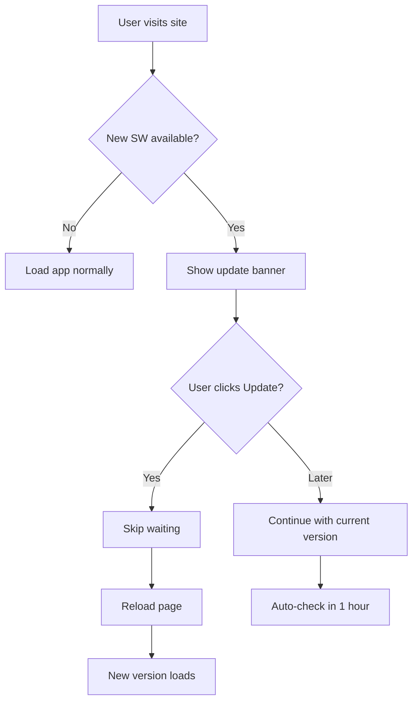

# Versioning & Deployment Guide

## 📦 Version Management

PoliVis uses **semantic versioning** (MAJOR.MINOR.PATCH) with automatic version injection.

### Single Source of Truth

All version information is stored in **`package.json`** and automatically propagated to:
- Service Worker cache names
- App footer display
- Build artifacts
- Console logs

### Version Format

```
MAJOR.MINOR.PATCH
  │     │     └─ Bug fixes, minor changes
  │     └─────── New features, backwards compatible
  └───────────── Breaking changes

```

## 🚀 Updating Versions

### Automatic (Recommended)

Use npm's built-in versioning:

```bash
# Patch version (1.0.0 → 1.0.1) - Bug fixes
npm run version:patch

# Minor version (1.0.0 → 1.1.0) - New features
npm run version:minor

# Major version (1.0.0 → 2.0.0) - Breaking changes
npm run version:major
```

These commands will:
1. Update `package.json` version
2. Create a git commit
3. Create a git tag
4. Push changes (optional)

### Manual

1. Update version in `package.json`
2. Run `npm run version:update` to update `version.ts`
3. Commit and push changes

## 🔄 Service Worker Updates

### How It Works

1. **Service Worker Versioning**: 
   - Each build injects the current version into `service-worker.js`
   - Cache names include version: `polivis-cache-1.0.0`
   - Old caches are automatically deleted on activation

2. **Update Detection**:
   - App checks for updates every hour
   - Users see an update banner when a new version is available
   - Click "Update Now" to load the new version immediately

3. **Cache Strategy**:
   - **HTML**: Network-first (always get latest)
   - **Assets (JS/CSS/Images)**: Stale-while-revalidate
   - **Offline Support**: Falls back to cached content

### Testing Updates Locally

```bash
# Build with new version
npm run version:patch
npm run build

# Preview the build
npm run preview

# Open in browser, make changes, rebuild
# The update banner should appear automatically
```

## 🌐 Deployment Best Practices

### GitHub Pages Deployment

The project uses GitHub Actions for automatic deployment:

1. **Push to main** → Triggers build and deploy
2. **Cache busting** happens automatically via:
   - Version-based cache names in Service Worker
   - Vite's content-hash filenames for assets
   - Network-first strategy for HTML

### Cache Busting

Multiple layers ensure users get the latest version:

#### 1. Service Worker Version
```javascript
const CACHE_NAME = `polivis-cache-${APP_VERSION}`;
```

#### 2. Vite Asset Hashing
```javascript
// Vite automatically adds content hashes
index-abc123.js  // Changes with each build
```

#### 3. Network-First for HTML
```javascript
// Always fetch fresh HTML from network
if (request.mode === 'navigate') {
  return fetch(request); // Get latest HTML
}
```

#### 4. Meta Tags
```html
<meta http-equiv="Cache-Control" content="no-cache, no-store, must-revalidate">
```

### Preventing Stale Versions

Common issues and solutions:

#### Issue: "Users stuck on old version"

**Solutions:**
1. ✅ Service Worker auto-updates every hour
2. ✅ Update banner prompts users to refresh
3. ✅ Network-first HTML strategy
4. ✅ Version-based cache names

#### Issue: "Updates not appearing immediately"

**Solution:**
```javascript
// Force immediate update (dev only)
await registration.update();
navigator.serviceWorker.controller.postMessage({ type: 'SKIP_WAITING' });
window.location.reload();
```

#### Issue: "Cached on CDN/GitHub Pages"

**Solution:**
- GitHub Pages respects cache headers
- Service Worker handles app-level caching
- Asset hashing prevents stale resources

## 📱 PWA Update Flow



## 🔧 Build Process

### Development
```bash
npm run dev
# - Uses unversioned SW
# - No cache busting
# - Hot reload enabled
```

### Production Build
```bash
npm run build
# 1. Updates version.ts with build date
# 2. Runs Vite build (creates dist/)
# 3. Injects version into service-worker.js
# 4. Copies SW to dist/
```

### Scripts Breakdown

| Script | Purpose |
|--------|---------|
| `version:update` | Updates version.ts with current package.json version |
| `version:patch` | Bumps patch version (1.0.0 → 1.0.1) |
| `version:minor` | Bumps minor version (1.0.0 → 1.1.0) |
| `version:major` | Bumps major version (1.0.0 → 2.0.0) |
| `postbuild` | Runs after build to inject version into SW |

## 📊 Monitoring Updates

### In Console

```javascript
// Check current version
console.log(`PoliVis v${APP_VERSION}`);

// Service Worker logs
[SW 1.0.0] Installing...
[SW 1.0.0] Caching essential resources
[SW 1.0.0] Activating...
[App v1.0.0] Service Worker registered
```

### In App

- Footer displays current version: `v1.0.0`
- Console shows version on load
- Update banner appears when new version available

## 🎯 Release Checklist

- [ ] Update version: `npm run version:patch/minor/major`
- [ ] Update CHANGELOG.md with changes
- [ ] Test build locally: `npm run build && npm run preview`
- [ ] Commit changes: Git will auto-commit version bump
- [ ] Push to main: `git push && git push --tags`
- [ ] Verify GitHub Actions deployment succeeds
- [ ] Test live site: Visit GitHub Pages URL
- [ ] Verify service worker updates correctly
- [ ] Check update banner appears (if testing old version)

## 🚨 Troubleshooting

### Service Worker Not Updating

```javascript
// In DevTools Console
navigator.serviceWorker.getRegistrations().then(regs => 
  regs.forEach(reg => reg.unregister())
);
// Then hard refresh (Ctrl+Shift+R)
```

### Version Mismatch

```bash
# Sync versions
npm run version:update
npm run build
```

### Clear All Caches

```javascript
// In DevTools Console
caches.keys().then(names => 
  Promise.all(names.map(name => caches.delete(name)))
);
```

## 📚 Additional Resources

- [Semantic Versioning Spec](https://semver.org/)
- [Service Worker Lifecycle](https://web.dev/service-worker-lifecycle/)
- [PWA Update Best Practices](https://web.dev/articles/service-worker-lifecycle)
- [Vite Build Optimization](https://vitejs.dev/guide/build.html)
